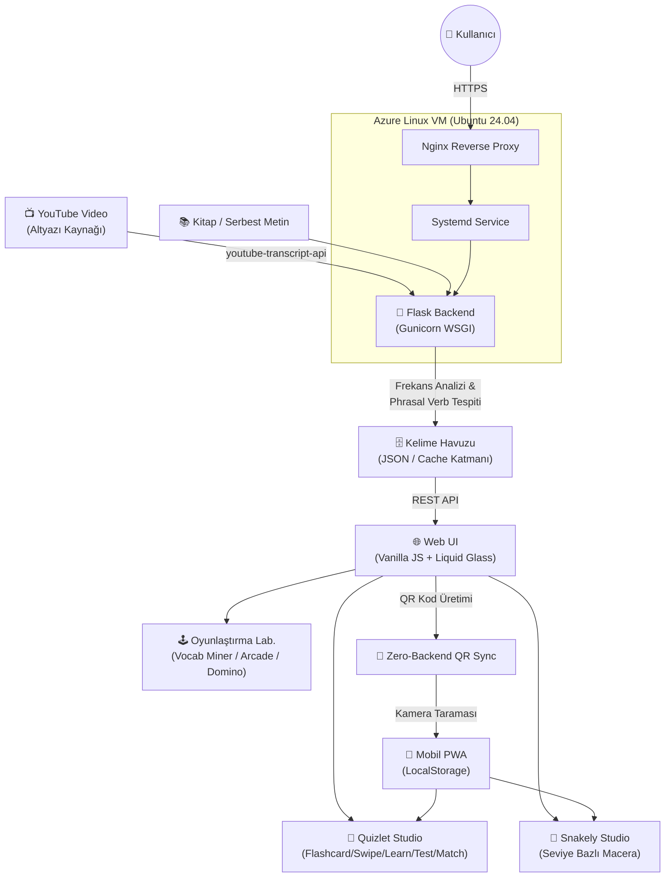

<div align="center">

```
██╗   ██╗████████╗    ██╗   ██╗ ██████╗  ██████╗ █████╗ ██████╗ 
╚██╗ ██╔╝╚══██╔══╝    ██║   ██║██╔═══██╗██╔════╝██╔══██╗██╔══██╗
 ╚████╔╝    ██║       ██║   ██║██║   ██║██║     ███████║██████╔╝
  ╚██╔╝     ██║       ╚██╗ ██╔╝██║   ██║██║     ██╔══██║██╔══██╗
   ██║      ██║        ╚████╔╝ ╚██████╔╝╚██████╗██║  ██║██████╔╝
   ╚═╝      ╚═╝         ╚═══╝   ╚═════╝  ╚═════╝╚═╝  ╚═╝╚═════╝ 

         S T U D Y   S T U D I O   ×   S N A K E L Y   S T U D I O
```

### 🎬 → 🧠 → 🕹️ → 📱
**YouTube'dan kelimeye, kelimeden oyuna, oyundan cebine.**
Uçtan uca bir dil öğrenme ekosistemi.

[](https://www.python.org/)
[](https://flask.palletsprojects.com/)
[](https://azure.microsoft.com/)
[](https://nginx.org/)
[](#)
[](#)
[](#-lisans-ve-telif-hakki)

</div>

---

## 📖 İçindekiler

- [Genel Bakış](#-genel-bakış)
- [Sistem Mimarisi ve Veri Akışı](#-sistem-mimarisi-ve-veri-akışı)
- [Modüller ve Özellikler](#-modüller-ve-özellikler)
- [Teknik Yığın](#-teknik-yığın)
- [Proje Dizin Yapısı](#-proje-dizin-yapısı)
- [Yerel Kurulum](#-yerel-kurulum--çalıştırma)
- [Azure Üzerinde Canlı Dağıtım](#-azure-üzerinde-canlı-dağıtım-rehberi)
- [API ve Rota Listesi](#-api-ve-rota-listesi)
- [Klavye Kısayolları](#-klavye-kısayolları)
- [Lisans ve Telif Hakkı](#-lisans-ve-telif-hakki)

---

## 🌍 Genel Bakış

**YT Vocab Study Studio & Snakely Studio**, YouTube video transkriptlerini ve serbest metinleri ham kelime hazinesine, ham kelime hazinesini ise aralıklı tekrar (SRS) destekli, oyunlaştırılmış bir öğrenme deneyimine dönüştüren entegre bir dil öğrenme platformudur.

Sistem beş katmandan oluşur:

1. **Madencilik Katmanı** — YouTube altyazılarından ve kitaplardan kelime/öbek çıkarımı
2. **Çalışma Katmanı (Quizlet Studio)** — Flashcard, swipe, learn-mode, test ve eşleştirme motorları
3. **Oyunlaştırma Katmanı** — Vocab Miner (Minecraft/WASM), Retro Arcade, Snakely Studio
4. **Arayüz Katmanı** — Liquid Glass UI, iOS 26 esintili floating dock
5. **Senkronizasyon Katmanı** — Sunucusuz QR tabanlı PWA veri aktarımı

Canlı ortam, **Azure Linux B1s** üzerinde **Nginx + Gunicorn + Systemd** üçlüsüyle 7/24 çalışacak şekilde yapılandırılmıştır.

---

## 🏗️ Sistem Mimarisi ve Veri Akışı



**Veri akışı özeti:**
`YouTube/Kitap` → `Flask Backend` → `Kelime Havuzu (Cache)` → `Web UI` → `Çalışma & Oyun Modülleri` → `QR Sync` → `Mobil PWA (LocalStorage)`

> Not: Mimari, ağır kullanıcı verisinin sunucuda tutulmasından kaçınacak şekilde tasarlanmıştır; ilerleme ve kelime havuzları istemci tarafında (LocalStorage) saklanır, sunucu yalnızca madencilik ve dağıtım görevlerini üstlenir.

---

## 🧩 Modüller ve Özellikler

### 🎬 Video & Metin Madenciliği

- **YouTube Altyazı Ayrıştırıcı** — `youtube-transcript-api` ile zaman damgalı transkript çekimi; kelime ve phrasal verb frekans analizi; öğrenilebilirlik skoruna göre kelime sıklığı ağırlıklandırma.
- **Çift Altyazılı Dual Player** — Video ile eşzamanlı akan Türkçe–İngilizce transkript; mini floating (picture-in-picture tarzı) oynatıcı modu.
- **Akıllı Kitap Okuyucu (Smart Reader)** — Uzun metin/kitapları otomatik sayfalara bölme; kelime üzerine anında çeviri (hover masaüstü / tap mobil); Web Speech API ile sesli telaffuz.

### 🧠 Quizlet ve SRS Çalışma Motorları (Quizlet Studio)

| Mod | Açıklama |
|---|---|
| **3D Kartlar** | CSS 3D transform perspektifiyle kart çevirme, TTS sesli okuma, otomatik oynatma, Fisher-Yates algoritmasıyla karıştırma |
| **Ayır & Sına (Swipe)** | Tinder/Anki esintili sağa-sola kart fırlatma; geri alma (undo); bilinmeyen kartları yeniden sınama döngüsü |
| **Aşamalı Öğren (Learn)** | Algoritmik aşama yönetimi: `Unseen → Familiar → Mastered`; dinamik çeldirici (distractor) motoru |
| **Test Sınavı** | Çoktan seçmeli + klavye girdili karma sınav; puanlama motoru |
| **Eşleştirme Oyunu** | Milisaniye hassasiyetli süreölçer ile terim-anlam eşleştirme |

### 🕹️ Oyunlaştırılmış Öğrenme Laboratuvarları

- **⛏️ Vocab Miner (Minecraft Modülü)** — WebGL/WASM tabanlı Eaglercraft 1.8.8 motoru; bilinmeyen kelimeler oyun dünyasında maden bloklarına ve tabelalara (sign) işlenir.
- **🕹️ Retro Arcade Arena** — Libretro Web Player üzerinden 8.500+ NES oyunu; belirli aralıklarla oyun donarak kelime doğrulaması ister.
- **🎲 Domino & Mini Oyunlar** — Canvas tabanlı interaktif mini oyunlar.
- **🐍 Snakely Studio** — A1–C1 Avrupa Dil Portföyü (CEFR) standartlarına göre seviye bazlı ilerleme; can/kalp sistemi; sandık açma mekaniği; seri (streak) takibi; SRS algoritmalarıyla entegre zorluk eğrisi.

### 📱 Mobil Mimari ve Liquid Glass UI

- iOS 26 ve Instagram esintili **yüzen dinamik kapsül tab bar** (Liquid Glass Dock).
- Donanım hızlandırmalı `backdrop-filter: blur(26px) saturate(180%)`, ışık kırılması (highlight/refraction) efektleri, dokunmatik tepki ve CSS yay (spring) animasyonlu morphing seçim baloncuğu.
- **Sıfır Sunucu QR Senkronizasyonu** — QR kod üretip telefon kamerasıyla okutarak PC'deki tüm kelime havuzunu ve ilerlemeyi doğrudan LocalStorage/PWA ortamına, herhangi bir sunucu aracılığı olmadan aktarma.

---

## 🛠️ Teknik Yığın

<table>
<tr><th>Katman</th><th>Teknolojiler</th></tr>
<tr><td><b>Backend</b></td><td>Python 3.12 · Flask · Gunicorn (WSGI) · youtube-transcript-api · Requests</td></tr>
<tr><td><b>Frontend</b></td><td>Vanilla JavaScript (ES6+ Modüler Yapı) · HTML5 · CSS3 (Neo-brutalism + Liquid Glassmorphism)</td></tr>
<tr><td><b>Altyapı & Dağıtım</b></td><td>Microsoft Azure Linux VM (Ubuntu 24.04) · Nginx Reverse Proxy · Systemd · Swap Memory Optimization</td></tr>
<tr><td><b>Kütüphaneler</b></td><td>Tabler Icons · Chart.js · QRCode.js · Html5-Qrcode · WebGL · Web Audio API</td></tr>
</table>

---

## 📂 Proje Dizin Yapısı

```
yt-vocab-study-studio/
├── app.py                      # Flask uygulama giriş noktası
├── wsgi.py                     # Gunicorn WSGI entry point
├── requirements.txt
├── .env.example
│
├── core/
│   ├── transcript_miner.py     # YouTube altyazı çekme & frekans analizi
│   ├── book_parser.py          # Kitap/metin sayfalama motoru
│   ├── srs_engine.py           # Aralıklı tekrar algoritması
│   └── distractor_engine.py    # Çeldirici üretim motoru
│
├── routes/
│   ├── api_transcript.py       # /api/transcript
│   ├── api_vocab.py            # /api/vocab
│   ├── mobile_routes.py        # /m
│   └── snakely_routes.py       # /snakely
│
├── static/
│   ├── css/
│   │   ├── liquid-glass.css    # Floating dock & glassmorphism
│   │   └── neo-brutalism.css
│   ├── js/
│   │   ├── quizlet/            # Flashcard, swipe, learn, test, match
│   │   ├── games/               # Domino & canvas mini oyunlar
│   │   ├── vocab-miner/         # Eaglercraft WASM entegrasyonu
│   │   ├── arcade/              # Libretro Web Player entegrasyonu
│   │   ├── snakely/             # Seviye motoru & CEFR mantığı
│   │   └── qr-sync.js           # Zero-backend QR senkronizasyon
│   └── assets/
│
├── templates/
│   ├── index.html
│   ├── reader.html
│   ├── mobile/
│   └── snakely/
│
├── deploy/
│   ├── nginx.conf               # Nginx reverse proxy yapılandırması
│   └── yt-vocab.service         # Systemd servis dosyası
│
└── README.md
```

---

## 💻 Yerel Kurulum & Çalıştırma

### Gereksinimler

- Python **3.12+**
- pip / venv
- (Opsiyonel) Node.js — statik varlık derleme adımları için

### Adımlar

```bash
# 1. Depoyu klonlayın
git clone https://github.com/<kullanici-adi>/yt-vocab-study-studio.git
cd yt-vocab-study-studio

# 2. Sanal ortam oluşturun ve etkinleştirin
python3 -m venv venv
source venv/bin/activate        # Windows: venv\Scripts\activate

# 3. Bağımlılıkları yükleyin
pip install -r requirements.txt

# 4. Ortam değişkenlerini ayarlayın
cp .env.example .env
# .env dosyasını kendi ayarlarınıza göre düzenleyin (PORT, SECRET_KEY, vb.)

# 5. Geliştirme sunucusunu başlatın
flask run --debug
# veya
python app.py
```

Uygulama varsayılan olarak `http://127.0.0.1:5000` adresinde çalışmaya başlar.

### Üretim Benzeri Yerel Test (Gunicorn ile)

```bash
gunicorn --workers 3 --bind 0.0.0.0:8000 wsgi:app
```

---

## ☁️ Azure Üzerinde Canlı Dağıtım Rehberi

### 1. Azure Linux VM Hazırlığı

```bash
# Ubuntu 24.04 B1s örneğine bağlanın
ssh azureuser@<vm-ip>

# Sistem paketlerini güncelleyin
sudo apt update && sudo apt upgrade -y

# Gerekli paketleri kurun
sudo apt install -y python3.12 python3.12-venv python3-pip nginx git
```

### 2. Swap Alanı Yapılandırması (B1s için önerilir)

```bash
sudo fallocate -l 2G /swapfile
sudo chmod 600 /swapfile
sudo mkswap /swapfile
sudo swapon /swapfile
echo '/swapfile none swap sw 0 0' | sudo tee -a /etc/fstab
```

### 3. Uygulamayı Sunucuya Yerleştirme

```bash
cd /var/www
sudo git clone https://github.com/<kullanici-adi>/yt-vocab-study-studio.git
cd yt-vocab-study-studio
python3.12 -m venv venv
source venv/bin/activate
pip install -r requirements.txt gunicorn
```

### 4. Systemd Servis Dosyası — `/etc/systemd/system/yt-vocab.service`

```ini
[Unit]
Description=YT Vocab Study Studio - Gunicorn Daemon
After=network.target

[Service]
User=azureuser
Group=www-data
WorkingDirectory=/var/www/yt-vocab-study-studio
Environment="PATH=/var/www/yt-vocab-study-studio/venv/bin"
ExecStart=/var/www/yt-vocab-study-studio/venv/bin/gunicorn \
          --workers 3 \
          --bind unix:/var/www/yt-vocab-study-studio/yt-vocab.sock \
          wsgi:app

Restart=always

[Install]
WantedBy=multi-user.target
```

```bash
sudo systemctl daemon-reload
sudo systemctl start yt-vocab
sudo systemctl enable yt-vocab
sudo systemctl status yt-vocab
```

### 5. Nginx Reverse Proxy — `/etc/nginx/sites-available/yt-vocab`

```nginx
server {
    listen 80;
    server_name your-domain.com;

    location / {
        include proxy_params;
        proxy_pass http://unix:/var/www/yt-vocab-study-studio/yt-vocab.sock;
    }

    location /static/ {
        alias /var/www/yt-vocab-study-studio/static/;
        expires 30d;
    }
}
```

```bash
sudo ln -s /etc/nginx/sites-available/yt-vocab /etc/nginx/sites-enabled
sudo nginx -t
sudo systemctl restart nginx
```

### 6. (Opsiyonel) SSL — Let's Encrypt

```bash
sudo apt install -y certbot python3-certbot-nginx
sudo certbot --nginx -d your-domain.com
```

---

## 🔌 API ve Rota Listesi

| Metod | Rota | Açıklama |
|---|---|---|
| `GET` | `/` | Ana sayfa / kontrol paneli |
| `POST` | `/api/transcript` | Verilen YouTube video ID'sinden transkript çekme ve frekans analizi |
| `GET` | `/api/vocab` | Kullanıcının kelime havuzunu döndürür |
| `POST` | `/api/vocab/add` | Kelime havuzuna yeni terim ekler |
| `GET` | `/reader` | Akıllı Kitap Okuyucu arayüzü |
| `GET` | `/quizlet/<mode>` | Çalışma modları (`flashcards`, `swipe`, `learn`, `test`, `match`) |
| `GET` | `/miner` | Vocab Miner (WebGL/WASM Minecraft modülü) |
| `GET` | `/arcade` | Retro Arcade Arena (Libretro Web Player) |
| `GET` | `/snakely` | Snakely Studio — seviye bazlı macera girişi |
| `GET` | `/snakely/level/<id>` | Belirli bir Snakely seviyesini başlatır |
| `GET` | `/m` | Mobil PWA arayüzü (Liquid Glass Dock) |
| `GET` | `/m/qr-sync` | QR senkronizasyon kodu üretimi |
| `GET` | `/manifest.json` | PWA manifest dosyası |

---

## ⌨️ Klavye Kısayolları

| Tuş | İşlev |
|---|---|
| `Space` | Kartı çevir / Oynat-Duraklat |
| `←` / `→` | Önceki / Sonraki kart |
| `↑` / `↓` | Biliyorum / Bilmiyorum (Swipe modu) |
| `Enter` | Cevabı onayla (Test modu) |
| `Ctrl + Z` | Son işlemi geri al (Undo) |
| `S` | Karıştır (Shuffle) |
| `M` | Sesi aç/kapat (Mute) |
| `Esc` | Modülden çık / Ana menüye dön |
| `Q` | QR senkronizasyon panelini aç |

---

## 📜 Lisans ve Telif Hakkı

```
Copyright © 2026 Muhammed Can Ceylan
Tüm Hakları Saklıdır. (All Rights Reserved)
```

Bu proje ve içeriğinde yer alan tüm kaynak kod, tasarım, mimari doküman ve varlıklar
**tescilli (proprietary)** yazılım kapsamındadır. Yazılı izin alınmaksızın kopyalanamaz,
çoğaltılamaz, değiştirilemez, dağıtılamaz veya ticari ya da ticari olmayan hiçbir amaçla
kullanılamaz.

---

<div align="center">

**Geliştirici:** Muhammed Can Ceylan
Made with 🧠 + ☕ + Azure

</div>
